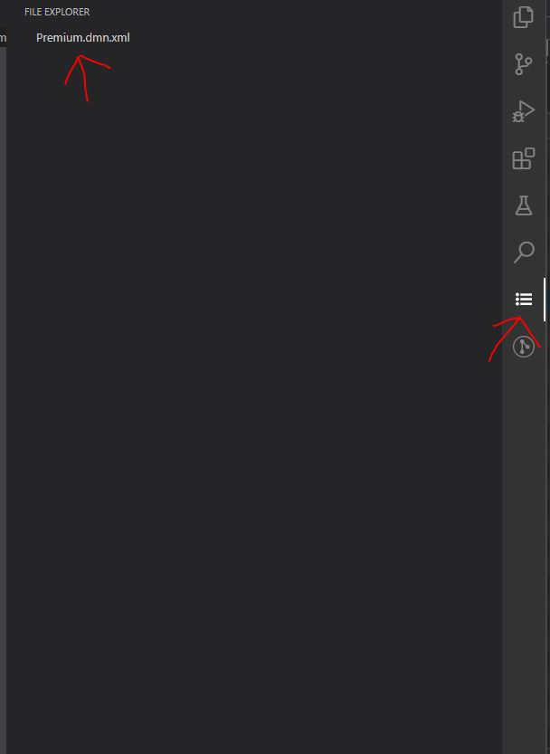

# Webview issue
The new version of webview failed to load resources.

- Vs Code Version:1.56.2
- OS version: Windows 10
- Node v12.16.1
- Npm 6.13.4

## `studio-webviews`:

studio-webviews is Angular 11 application for generating webviews content.

## `custom-editor-sample`:

custom-editor-sample is visual studio code extension application where you can reproduce problem.

## Steps to Reproduce:

In `studio-webviews` folder:
- yarn install
- ng build

In  `custom-editor-sample` folder:
- npm install
- `F5` to start debugging

When you start extension in `activitybar` you can find and select `File explorer` button. File `Premium.dmn.xml` will be loaded and shown. 

If you select `Premium.dmn.xml` file you can see icons will not be loaded.

If you select `Premium.dmn.xml` file from filesystem (Explorer) everything works.

For more details you can watch video `./video/WebviewIssue.mp4`